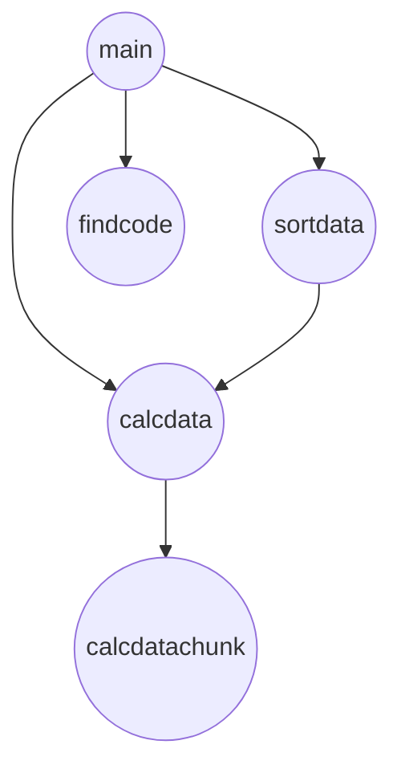

# Pymmo

Ce projet a été réalisé par Alfred Vié et Mathis Pipart  

Pour mener à bien notre projet nous avons choisi d'utiliser des données sur l'immobilier  
Pour cela nous avons utilisé les données open source proposé par le gouvernement  

> **Ressources** :  
> * Lien des ressources : https://www.data.gouv.fr/fr/datasets/5c4ae55a634f4117716d5656/  
> * Description des données : https://www.data.gouv.fr/fr/datasets/r/d573456c-76eb-4276-b91c-e6b9c89d6656  

Nous avons ainsi utiliser ses données en statiques, c'est à dire que nous les avons stockés dans un dossier nommé "DATA"  

## User Guide

Pour déployer et utiliser notre dashboard il est nécessaire d'effectuer quelques manipulations.  
il faut dans un premier temps installer les modules nécessaire, pour cela lancer la commande :  
> **python -m pip install -r requirements.txt**  

Dans un dernier temps il faut lancer le main.py pour créer le dashboard:
> **python3 main.py**

Le dashboard sera créé sur l'url 
> http://127.0.0.1:8050/  

## Rapport d’analyse
### L'histogramme
L'histogramme affiche la surface moyenne des maisons par commune, on remarque ainsi que en moyenne en France une maison fait environ entre 50m² et 150m² avec un pic à 100m².   

### Les cartes  
Les cartes varient du noir (taux faible) au rouge (taux élevé) en fonction des données contenu dans le dataset.  
On remarque que les 2 cartes se ressemblent fortement ainsi le prix moyen pour tout type de bien et le prix au m² pour les maisons sont en corrélation.  
Par exemple l'Alsace et la Bourgogne (zone noire) sont peu chères comparées à l'Ile-de-France et la côte d'Azur (zone rouge).  
Cependant on constate quelques différences:  
Dans la région Rhône-Alpes le prix moyen pour tout type de bien est plus élevé (zone rouge) donc supérieur à la moyenne tandis que pour la carte du prix au m² pour les maisons la région Rhône-Alpes est une zone noire, est donc inférieur à la moyenne.   
Cela explique que ce sont les autres types de bien que les maisons (les appartements...) qui sont supérieur en prix au m² dans la région Rhône-Alpes.

## Developper Guide
Le code a été développé de manière structuré avec des fonctions et un "*main*" les appelants.  
Ce mode de fonctionnement permet au code une amélioration facile et pratique à l'avenir.  
Les fonctions utilisées:
* ***sortdata*** : permet de trier les transactions par code commune
* ***calcdata*** : permet de faire les calculs pour tous, les biens, seulement les maisons, seulement les apparts et seulement les locaux commerciaux
* ***calcdatachunk*** : fait les calculs pour 1 type de bien
* ***findcode*** : permet de formatter le code commune qui est séparé dans les fichiers d'entrée
* ***main*** : téléchargement des données et création du dashboard

